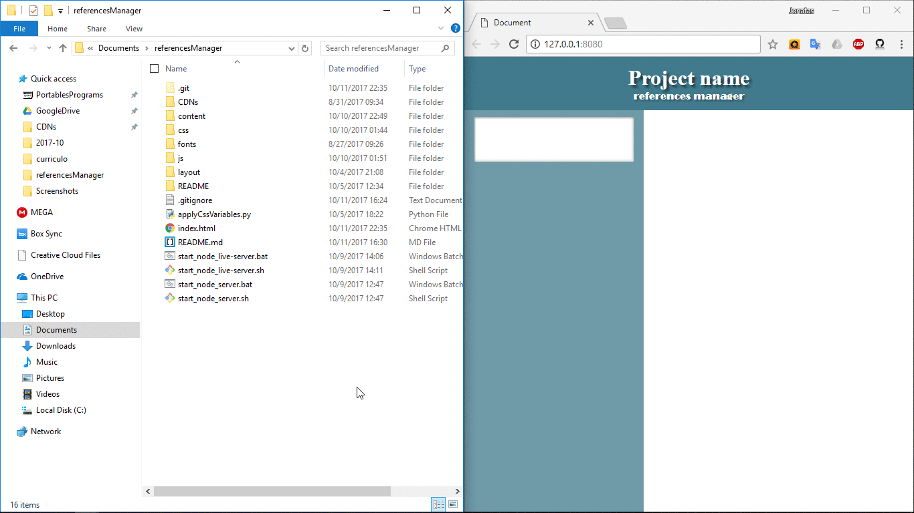
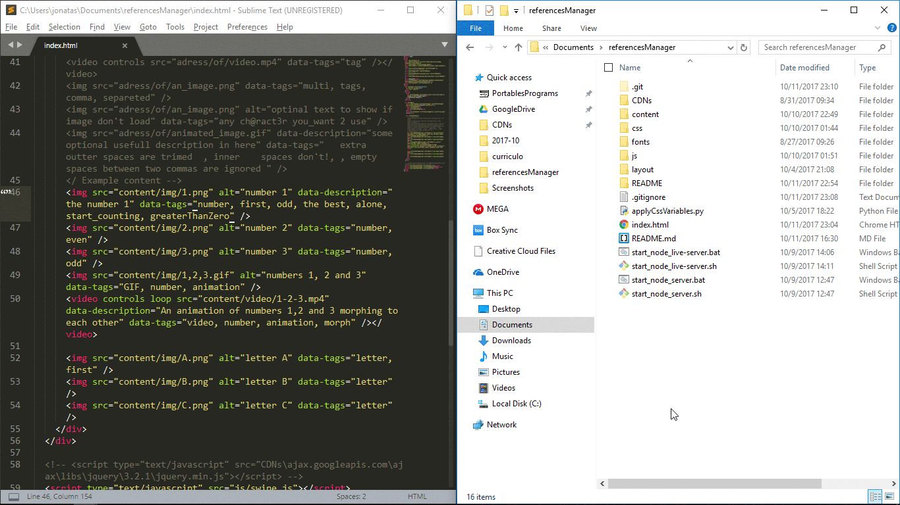
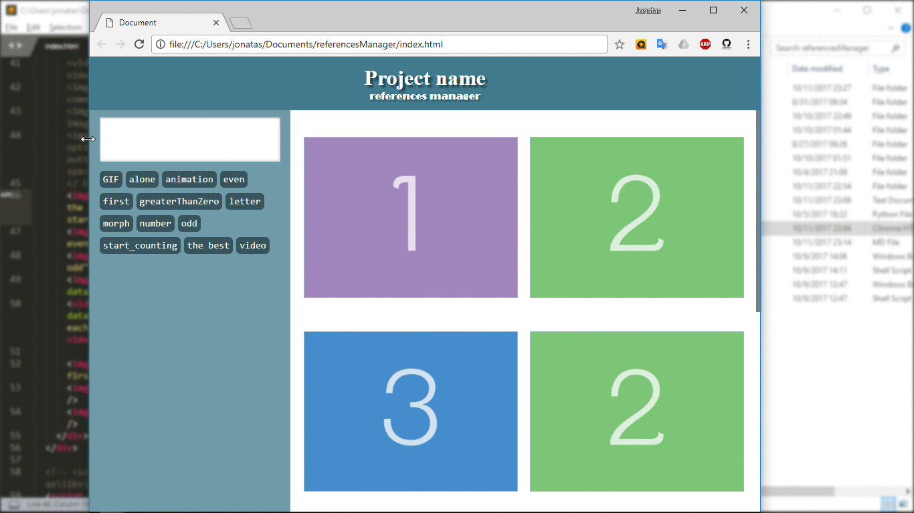
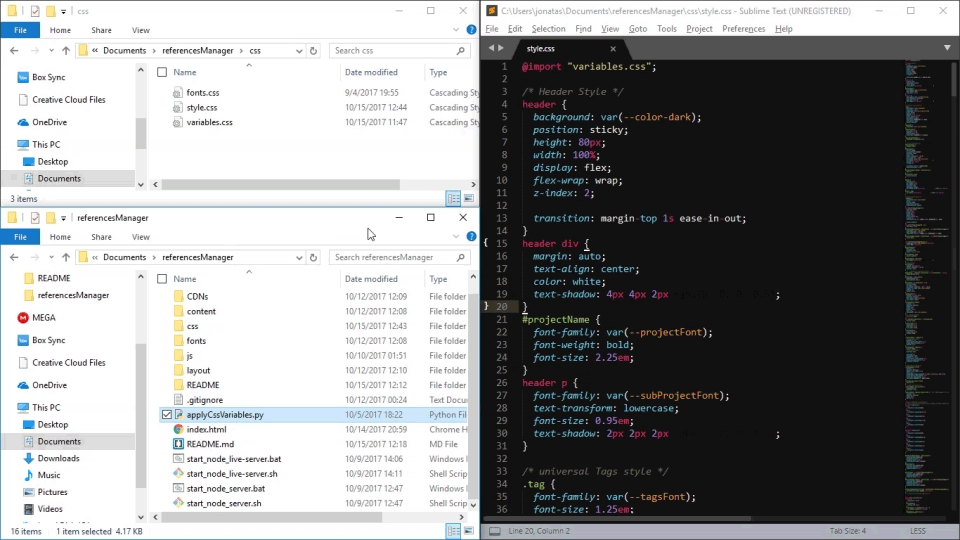

**References Manager**
========
A simple html app to view video and image (also GIFs) references for any kind of project, tag then, and filter by it's tags to easy access of an specific subject.
Planned to have a small size, be used offline, with file protocol. Not needing any server program, or advanced knowledge.

--------------------

_version **alpha 1**_
----------
In this version:
* Can add images/videos with some tags (editing the HTML file)
* Filter those images/videos by the tags
* Double click images to view image in it's maximum size
* Personalize fonts and colors in a separated CSS variables file
* Locally rename project inside the app


### Get started
This version needs some manual configuration, as add images and it's tags. There's some functions to help, but still, some things are needed.

You have to put the images/videos manually in the HTML file. It goes inside the `div` with `id` of "references":
```HTML
<div id="references">
  ...
</div>
```
Use correspond HTML tag to the content you want ( `` to images, and `<video> </video>` videos).  
Following the syntax:

**video**
```HTML
<video src="address/of/video.mp4" data-description="some optional description in here" data-tags="tags, here, comma separated" /></video>
```

**image**
```HTML

```

Where:
* `src="..."` is the address of the image/video. The `/` character indicates directories.  
_The address can be relative to the HTML file, or absolute, like a full web address (ex. `www.website/sources/image.jpg`), or a local file (ex. `C:/users/You/videos/animation.mp4`).  
Ps. local files just work in `file://` protocol (with is the target of this application)._
Althought, the recommendation is to put the content in the specific folders inside the `content/` directory. `img/` for images, and `video/` for videos.
* `alt="..."` attribute is used to show a text if image fails to load, it is optional, and works in `` only.
* `data-description="..."` is a optional attribute, to put some useful description to the reference.
* `data-tags="..."` here is where you put the tags of the reference.  
They are separated by ``,`` [comma] character, and can have any character you want, except for the separation character, obviously. It can be omitted too, if for some reason, you don't want an content to have any tag.

The order that you place the references, is the order that will the displayed in app. Future versions should count with some reorder functions.



<br />

#### Using the app
The use is really simple. Just open up the `index.html`, and it will open in your main web browser.  

The images/videos you added are displayed in the canvas. Putting the mouse over some of then, shows the file's name, it's description and tags. Can scroll or drag tag's list horizontally if tags don't fits in the available space.  

In the side panel, the gray box display the tags being used to filter the references, only images/videos that have at least one of these tags are displayed in the canvas (if empty, all content is displayed). Below there's all available tags (those used by all the references you added), sorted alphabetically  
Click in one of "available tags" to add it to filter, ctrl+click to add JUST that tag (remove the others). Click one in the filter box to remove it.  



In small screens, like mobile (see [here](/#use-remotely) how to use in mobile), this panel is hidden. To show it, just click in the floating button in the left-bottom corner.



<br />

#### Personalize colors and fonts
If you want, you can easily do some basic personalization of colors and fonts, knowing just a bit of CSS.

In **css** folder, there is a `variables.css` file. Inside of it, there is some variables that hold the "easily changeable" parameters, following this syntax:
```css
{--variable-name: value;}
```
_**Don't change the variable name, just it's value.**_

###### **colors**  
The colors are written in _`RGB`_ form: `rgba(255, 255, 255, 1)`. Each number between the parenthesis representing, in order, the **RED**, **GREEN**, and **BLUE** color channels, being integer numbers from **_0_** to **_255_**, and **ALPHA** channel (opacity/transparency), a decimal number from **_0_** to **_1_** (_0%_ to _100%_).  
You can also use any other type of CSS color. By default the app uses a _**monocrome**_ pallete, but you can change it how you want.  
Be noticed that some times it uses a color a bit transparent.

###### **fonts**
Fonts use a bit different syntax:  
`Arial, Helvetica, sans-serif};`. That is a list of fonts. The browser tries to use the first font, if it is not installed in the computer, it tries de second, and so on. The final item is a "back-up" state, that says "use any available _sans-serif_ font".
If the font you want, has space in it's name, it should be inside `" "` characters [quote-marks].


###### In case your browser doesn't support CSS variables
In case you use a old browser, that doesn't support _CSS variables_, you may notice some colors gone, and wrong fonts. To solve that, in app's root folder there is a python script, that will "apply" those variables.  
To run it, make sure you have [python]("www.python.org") installed, then run the code by double clicking it. The script will also create a `backup_style.css` in the same folder of the original file, in case you need it. Than you will be able to deleted the actual one, and remove the _"backup"_ from it's name, to return things to original state.



#### Use remotely
You can always upload the app to a host, although the app objective is to be a light **_OFFLINE_** resource.

If you need or just want access those references from another computer/device, you can use a local server on the computer, to grand access to it from devices connected on the same network.  
In the root folder there is "system scripts" to launch a local server, run one of these scripts, and a command prompt will ask for a port number, just press ``[enter]`` to keep the default, or type a number you like, so the server will be "online". To run this scripts, you need to have installed **[Node.js]("www.nodejs.org")**, and a proper package, depending on the script you choose:
* For *`start_node_server`*, you need the `http-server` package. Install it running in the terminal `npm -g install http-server`.  
When you run this one, it shows the addresses you can use to access the app. The first one ()`http://127[...]`) is for access in the same computer, the second (`http://192[...]`) is the address you need to access from other device (if connected on the same network). Just type it on the address bar of the devices' browser.
* For *`start_node_live-server`*, you need the `live-server` package. You can install it running `npm -g install live-server`.  
This one may only shows the machine address (`http://127[...]`), and not the network address (`http://192[...]`).

If you're not connected to a network when start the server, the network address will not be displayed. But you don't need to disconnect and launch the server again.  
After connect to a network, open other terminal instance and:
* **windows** - run `ipconfig`, then search for `ipv4:` line, there is the address at the end of line.
* **linux** - run `ifconfig` find the network you are connect to, and in it's section llok for the `inet addr:` address, there it is.
